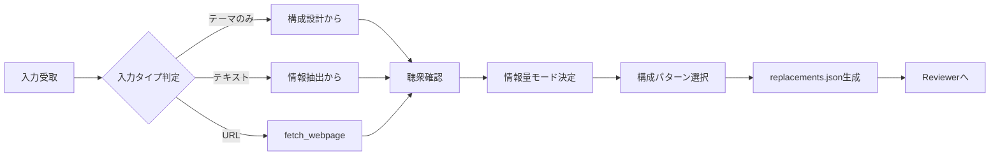

# Purpose: Report / Proposal Instructions

報告・提案・説明プレゼンテーション用のコンテンツ作成ルール。

> 📊 **対象**: 社内報告、企画提案、説明資料、進捗報告、成果発表

> ⚠️ **重要: 方式による JSON 形式の違い**
>
> 本ドキュメントは **preserve 方式（experimental）** 用の `replacements.json` を例示しています。
>
> | 方式                              | JSON ファイル       | items/bullets の形式                              |
> | --------------------------------- | ------------------- | ------------------------------------------------- |
> | **reconstruct/summarize（推奨）** | `content.json`      | `"items": ["文字列1", "文字列2"]`                 |
> | preserve（experimental）          | `replacements.json` | `"paragraphs": [{"text": "...", "bullet": true}]` |
>
> **reconstruct/summarize 方式を使用する場合は、`workspace/content.schema.json` のスキーマに従ってください。**
> → 詳細: [common.instructions.md の「IR スキーマの使い分け」](common.instructions.md)

---

## メタ情報

| 項目             | 値                                                      |
| ---------------- | ------------------------------------------------------- |
| 用途 ID          | `report`                                                |
| 推奨方式         | テンプレートベース                                      |
| 推奨情報量       | 標準（📑）                                              |
| 想定スライド数   | 8-30 枚（情報量モードで変動）                           |
| 必須セクション   | タイトル, サマリー, 本文, Next Action                   |
| 使用エージェント | Template Analyzer → Content Writer → Reviewer → Builder |

---

## クイックスタート



### 手順

1. **入力タイプ判定**: テーマのみ / テキスト / URL
2. **聴衆確認**: 経営層 / マネージャー / 実務担当 / 外部 / 混合
3. **情報量モード決定**: 簡潔 / 標準 / 詳細
4. **構成パターン選択**: 報告 / 提案 / 説明
5. **コンテンツ作成**: replacements.json 生成
6. **チェックリスト検証**: Reviewer 観点で自己チェック

---

## 入力タイプ別の処理

### タイプ A: テーマのみ

```
入力例: 「Q3売上報告を作って」

処理:
1. 追加情報をユーザーに確認（数字、成果、課題など）
2. 確認できない場合はプレースホルダーで作成
3. [要確認] マークを付けてReviewerに渡す
```

### タイプ B: テキスト（情報あり）

```
入力例: 詳細なテキストが提供される

処理:
1. 情報を構造化して抽出
2. 構成パターンに当てはめる
3. 不足情報は [要確認] マーク
```

### タイプ C: URL

```
入力例: 社内Wiki、ドキュメントのURL

処理:
1. fetch_webpage で内容取得
2. 見出し構造を分析
3. スライド構成にマッピング
```

---

## 基本方針

### 結論ファースト（BLUF: Bottom Line Up Front）

> 「で、結局何？」に最初のスライドで答える。

```
1. 結論（何を伝えたいか）← 最初に言え
2. 理由（なぜそう言えるか）
3. 詳細（具体的な内容）
4. Next Action（何をすべきか）
```

### 聴衆設定（必須確認）

| 聴衆タイプ           | 求めるもの           | 注意点                   |
| -------------------- | -------------------- | ------------------------ |
| 経営層               | 結論・数字・判断材料 | 詳細不要、Appendix へ    |
| マネージャー         | 進捗・課題・リソース | 判断に必要な情報を網羅   |
| 実務担当者           | 具体的手順・詳細     | 背景説明は簡潔に         |
| 外部ステークホルダー | 成果・価値・信頼性   | 専門用語を避ける         |
| 混合                 | 構造化＋ Appendix    | 本編は概要、詳細は後ろへ |

---

## 情報量別の設計

### モード別ガイドライン

| モード  | スライド数 | 1 スライド文字数 | 箇条書き数 | 想定シーン             |
| ------- | ---------- | ---------------- | ---------- | ---------------------- |
| 📄 簡潔 | 5-8 枚     | 50-80 字         | 3-4 個     | 口頭補足前提、定例報告 |
| 📑 標準 | 8-12 枚    | 80-120 字        | 4-5 個     | スタンドアロン、共有用 |
| 📚 詳細 | 12-20 枚   | 100-150 字       | 5-7 個     | 正式報告、Appendix 含  |

### モード選択フロー

```
口頭で補足できる？
  ├─ Yes → 📄 簡潔
  └─ No → 資料だけで完結すべき？
           ├─ Yes → 正式な報告書？
           │         ├─ Yes → 📚 詳細
           │         └─ No → 📑 標準
           └─ No → 📑 標準
```

---

## 構成パターン

### パターン A: 報告（実績・進捗・調査結果）

```
1. タイトル + 結論サマリー（1枚で全体像）
2. 背景・目的（なぜこの報告をするか）
3. 実施内容 / 調査結果（やったこと・わかったこと）
4. 成果・結果（数字で示す）
5. 課題・学び（良かった点・改善点）
6. Next Action（誰が・いつまでに・何を）
[Appendix] 詳細データ、参考資料、Q&A想定
```

**使用シーン**: 四半期報告、プロジェクト完了報告、調査報告

### パターン B: 提案（企画・改善案）

```
1. タイトル + 提案サマリー（結論を先に）
2. 現状の課題（As-Is：今何が問題か）
3. 提案内容（To-Be：何をするか）
4. 期待効果（Why：なぜこの提案か）
5. 実施方法（How：どうやるか）
6. スケジュール・リソース・コスト
7. リスクと対策
8. Next Step（承認事項・依頼事項）
[Appendix] 比較表、詳細見積、技術詳細
```

**使用シーン**: 新規企画、改善提案、ツール導入提案

### パターン C: 説明（教育・共有）

```
1. タイトル + 今日のゴール（これを見ると何がわかるか）
2. 全体像・概要（まず俯瞰）
3. 詳細 ①（セクション分け）
4. 詳細 ②
5. 詳細 ③
6. まとめ（持ち帰りポイント）
[Appendix] 用語集、参考リンク、FAQ
```

**使用シーン**: 新機能説明、オンボーディング、ナレッジ共有

---

## スライドタイプ別ガイド

### 1. タイトルスライド

```json
{
  "slide-0": {
    "shape-0": {
      "paragraphs": [
        { "text": "Q3 売上報告\u000b〜過去最高を更新〜", "font_size": 44.0 }
      ]
    },
    "shape-1": {
      "paragraphs": [{ "text": "営業部 第1グループ\u000b2024年10月15日" }]
    }
  }
}
```

**ポイント:**

- タイトルで **内容 + 結論** がわかる
- サブタイトルに発表者・部署・日付
- 興味を引くキーワード（数字、成果）を入れる

**タイトル例:**

| ❌ 弱い            | ✅ 強い                            |
| ------------------ | ---------------------------------- |
| 「Q3 報告」        | 「Q3 報告：売上 120%達成」         |
| 「新システム提案」 | 「コスト 30%削減：新システム提案」 |
| 「調査結果」       | 「市場調査：需要 2 倍の成長機会」  |

### 2. エグゼクティブサマリー（経営層向け必須）

```json
{
  "slide-1": {
    "shape-0": {
      "paragraphs": [{ "text": "サマリー" }]
    },
    "shape-1": {
      "paragraphs": [
        {
          "text": "結論: Q3売上は過去最高の1.2億円（前年比+20%）",
          "bullet": true,
          "level": 0,
          "bold": true
        },
        {
          "text": "要因: 新規顧客15社獲得、リピート率85%",
          "bullet": true,
          "level": 0
        },
        { "text": "課題: 人員不足による機会損失", "bullet": true, "level": 0 },
        {
          "text": "提案: Q4は2名増員で1.5億円を目指す",
          "bullet": true,
          "level": 0
        },
        {
          "text": "依頼: 増員の承認（本日中）",
          "bullet": true,
          "level": 0,
          "bold": true
        }
      ]
    }
  }
}
```

**ポイント:**

- このスライドだけで意思決定できる情報量
- 結論 → 根拠 → 課題 → 提案 → 依頼 の順
- 依頼事項は明確に

### 3. 背景・目的スライド

```json
{
  "slide-2": {
    "shape-0": {
      "paragraphs": [{ "text": "背景と目的" }]
    },
    "shape-1": {
      "paragraphs": [
        { "text": "背景", "bullet": true, "level": 0, "bold": true },
        {
          "text": "市場環境の変化により新たな対応が必要",
          "bullet": true,
          "level": 1
        },
        {
          "text": "競合A社がシェア拡大（前年比+15%）",
          "bullet": true,
          "level": 1
        },
        { "text": "目的", "bullet": true, "level": 0, "bold": true },
        { "text": "Q3の成果と課題を共有", "bullet": true, "level": 1 },
        { "text": "Q4戦略の方向性を決定", "bullet": true, "level": 1 }
      ]
    }
  }
}
```

### 4. 結果・成果スライド（数字で語る）

```json
{
  "slide-3": {
    "shape-0": {
      "paragraphs": [{ "text": "成果：売上120%達成" }]
    },
    "shape-1": {
      "paragraphs": [
        {
          "text": "売上: 1.2億円（目標1億円、達成率120%）",
          "bullet": true,
          "level": 0
        },
        {
          "text": "新規顧客: 15社（目標10社、達成率150%）",
          "bullet": true,
          "level": 0
        },
        {
          "text": "リピート率: 85%（前年80%、+5pt）",
          "bullet": true,
          "level": 0
        },
        { "text": "顧客満足度: 4.5/5.0（前年4.2）", "bullet": true, "level": 0 }
      ]
    }
  }
}
```

**数字の見せ方:**

| ❌ NG            | ✅ OK                               |
| ---------------- | ----------------------------------- |
| 「売上が増えた」 | 「売上 120%達成（1.2 億円）」       |
| 「多くの顧客」   | 「新規顧客 15 社（目標比 150%）」   |
| 「改善された」   | 「処理時間 50%短縮（10 分 →5 分）」 |
| 「好評だった」   | 「満足度 4.5/5.0（前年比+0.3）」    |

### 5. 課題・学びスライド

```json
{
  "slide-4": {
    "shape-0": {
      "paragraphs": [{ "text": "課題と学び" }]
    },
    "shape-1": {
      "paragraphs": [
        { "text": "良かった点", "bullet": true, "level": 0, "bold": true },
        { "text": "新規開拓の仕組み化が成功", "bullet": true, "level": 1 },
        { "text": "チーム連携が向上", "bullet": true, "level": 1 },
        { "text": "課題", "bullet": true, "level": 0, "bold": true },
        {
          "text": "人員不足で機会損失（推定2000万円）",
          "bullet": true,
          "level": 1
        },
        {
          "text": "大型案件の受注率が低下（30%→25%）",
          "bullet": true,
          "level": 1
        },
        { "text": "学び", "bullet": true, "level": 0, "bold": true },
        { "text": "早期のリソース確保が成長のカギ", "bullet": true, "level": 1 }
      ]
    }
  }
}
```

### 6. Next Action スライド

```json
{
  "slide-5": {
    "shape-0": {
      "paragraphs": [{ "text": "Next Action" }]
    },
    "shape-1": {
      "paragraphs": [
        {
          "text": "本日: 増員承認（依頼）",
          "bullet": true,
          "level": 0,
          "bold": true
        },
        { "text": "判断者: 部長", "bullet": true, "level": 1 },
        { "text": "今週中: 採用計画策定", "bullet": true, "level": 0 },
        { "text": "担当: 人事部 田中", "bullet": true, "level": 1 },
        { "text": "来週: Q4キックオフ", "bullet": true, "level": 0 },
        { "text": "参加者: 全チームメンバー", "bullet": true, "level": 1 },
        { "text": "月末: 新メンバー合流", "bullet": true, "level": 0 }
      ]
    }
  }
}
```

**ポイント:**

- **誰が** / **いつまでに** / **何を** を明記
- 依頼事項は **太字** で強調
- 期限は具体的に（「近日中」ではなく「10/18 まで」）

---

## 視覚化ガイド

### いつ図解を使うか

| 内容         | 推奨ビジュアル      |
| ------------ | ------------------- |
| 数値の推移   | 折れ線グラフ        |
| 構成比       | 円グラフ / 棒グラフ |
| 比較         | 棒グラフ / テーブル |
| プロセス     | フローチャート      |
| 構造         | ブロック図          |
| Before/After | 2 カラム比較        |
| 時系列       | タイムライン        |

### 図解の原則

- **1 スライド = 1 図解**（複数入れない）
- 凡例は図の近くに
- 色は 3 色以内
- 強調したい部分を目立たせる

---

## 見出しの付け方

| ❌ 弱い見出し | ✅ 強い見出し                     |
| ------------- | --------------------------------- |
| 「調査結果」  | 「調査結果：需要 2 倍の成長機会」 |
| 「まとめ」    | 「まとめ：3 つの成功要因」        |
| 「背景」      | 「背景：なぜ今やるのか」          |
| 「課題」      | 「課題：機会損失 2000 万円」      |
| 「提案」      | 「提案：コスト 30%削減案」        |

> **見出し = そのスライドの結論** と考える

---

## 箇条書きの階層ルール

```
Level 0: 大項目（5 個以内）
  Level 1: 中項目（各 3 個以内）
    Level 2: 詳細（各 2 個以内）→ できれば Appendix へ
```

### 階層が深くなりすぎたら

- Level 2 以上 → Appendix へ移動
- スライドを分割
- 図解に変換

---

## Appendix の使い方

### Appendix に回すもの

- 詳細な数値データ・表
- 比較表・一覧表
- 技術的な詳細
- 参考資料・出典リスト
- Q&A 想定問答
- バックアップスライド

### 本編からの誘導

```json
{ "text": "→ 詳細は Appendix A 参照", "bullet": true, "level": 1 }
```

### Appendix の命名

```
Appendix A: 詳細データ
Appendix B: 比較表
Appendix C: 技術仕様
Appendix D: Q&A想定
```

---

## チェックリスト

### 構成チェック

- [ ] 結論が最初のスライドにある
- [ ] 聴衆に合った情報量になっている
- [ ] 論理の流れが自然（Why → What → How）
- [ ] Next Action が具体的（誰・いつ・何）
- [ ] 詳細は Appendix に分離

### コンテンツチェック

- [ ] 数字が具体的（曖昧な表現なし）
- [ ] 比較対象が明記されている
- [ ] 見出しに結論が入っている
- [ ] 依頼事項が明確

### フォーマットチェック

- [ ] 1 スライド = 1 メッセージ
- [ ] 箇条書き 5 個以内
- [ ] 文字数 150 字以内
- [ ] 階層は Level 1 まで（Level 2 は最小限）

---

## よくあるミス

| ミス                 | 対処                               |
| -------------------- | ---------------------------------- |
| 結論が最後にしかない | タイトルと冒頭で結論を示す         |
| 数字がない           | 定量的な成果を追加                 |
| Next Action が曖昧   | 「誰が」「いつまでに」「何を」明記 |
| 1 スライドに詰め込み | 分割 or Appendix へ                |
| 前提説明が長い       | 背景は 1-2 スライドに収める        |
| 聴衆を意識していない | 最初に聴衆タイプを確認             |

---

## 参照

- `.github/instructions/template.instructions.md` - テンプレート操作
- `.github/agents/json-reviewer.agent.md` - JSON レビュー観点
- `.github/agents/pptx-reviewer.agent.md` - PPTX レビュー観点

---

## 出力仕様

### replacements.json の必須構造

```json
{
  "metadata": {
    "purpose": "report",
    "variant": "report|proposal|explanation",
    "density": "concise|standard|detailed",
    "audience": "executive|manager|staff|external|mixed",
    "slide_count": 10,
    "generated_at": "2024-10-15T10:00:00Z",
    "source_type": "theme|text|url",
    "source_url": "https://example.com/article",
    "warnings": ["[要確認] 売上数値が未確定"]
  },
  "slides": {
    "slide-0": { ... },
    "slide-1": { ... }
  }
}
```

### metadata フィールド説明

| フィールド   | 必須 | 説明                                        |
| ------------ | ---- | ------------------------------------------- |
| purpose      | ✅   | `report` 固定                               |
| variant      | ✅   | 構成パターン（report/proposal/explanation） |
| density      | ✅   | 情報量モード                                |
| audience     | ✅   | 聴衆タイプ                                  |
| slide_count  | ✅   | スライド総数                                |
| generated_at | ✅   | 生成日時（ISO 8601）                        |
| source_type  | ✅   | 入力タイプ                                  |
| source_url   | -    | URL 入力時のみ                              |
| warnings     | -    | 要確認事項のリスト                          |

---

## 禁止事項（この用途特有）

| 禁止                       | 理由                    | 代替                      |
| -------------------------- | ----------------------- | ------------------------- |
| 結論を最後にだけ置く       | 経営層は最初しか見ない  | タイトル+サマリーに結論   |
| 「〜と思います」の多用     | 自信がないように見える  | 断言 or データで裏付け    |
| 数字なしの成果報告         | 説得力がない            | 定量的な数値を必ず入れる  |
| Next Action が曖昧         | 誰も動けない            | 誰が/いつまでに/何を 明記 |
| 聴衆を無視した詳細度       | 経営層に技術詳細は不要  | Appendix に分離           |
| 1 スライドに複数メッセージ | 伝わらない              | 1 スライド=1 メッセージ   |
| 専門用語の説明なし         | 外部/経営層に伝わらない | 括弧書きで補足 or 用語集  |

---

## Reviewer 連携

### 中間レビュー（Stage 1）で確認される観点

Content Writer は以下の観点を事前にセルフチェックすること:

| 観点           | チェック内容                                      |
| -------------- | ------------------------------------------------- |
| 構造整合性     | metadata.variant と実際の構成パターンが一致するか |
| 結論ファースト | slide-0 または slide-1 に結論があるか             |
| 数値の具体性   | 曖昧な表現（「多くの」「改善された」）がないか    |
| Next Action    | 誰/いつ/何 が明記されているか                     |
| 情報量の適切さ | density モードに応じたスライド数/文字数か         |
| 警告マーク     | [要確認] が適切に付与されているか                 |

### 差し戻し時の対応

```
Reviewer から差し戻しがあった場合:
1. 指摘された観点を確認
2. 該当箇所を修正
3. metadata.warnings に修正履歴を追記
4. 再度 Reviewer へ提出
```

---

## 情報量モード別の詳細仕様

### 📄 簡潔モード（concise）

| 項目             | 仕様                                 |
| ---------------- | ------------------------------------ |
| スライド数       | 5-8 枚                               |
| 1 スライド文字数 | 50-80 字                             |
| 箇条書き数       | 3-4 個/スライド                      |
| 階層             | Level 0 のみ（Level 1 は最小限）     |
| Appendix         | なし or 1 枚                         |
| 想定シーン       | 定例報告、口頭補足前提、時間制限あり |

**簡潔モードの構成例（報告）:**

```
1. タイトル + 結論
2. 成果（数字で）
3. 課題
4. Next Action
[Appendix] 詳細データ（必要時のみ）
```

### 📑 標準モード（standard）

| 項目             | 仕様                                     |
| ---------------- | ---------------------------------------- |
| スライド数       | 8-12 枚                                  |
| 1 スライド文字数 | 80-120 字                                |
| 箇条書き数       | 4-5 個/スライド                          |
| 階層             | Level 0-1                                |
| Appendix         | 2-3 枚                                   |
| 想定シーン       | スタンドアロン資料、共有用、一般的な報告 |

**標準モードの構成例（報告）:**

```
1. タイトル + 結論サマリー
2. エグゼクティブサマリー
3. 背景・目的
4. 実施内容 / 調査結果
5. 成果・結果
6. 課題・学び
7. Next Action
[Appendix A] 詳細データ
[Appendix B] 参考資料
```

### 📚 詳細モード（detailed）

| 項目             | 仕様                               |
| ---------------- | ---------------------------------- |
| スライド数       | 12-20 枚                           |
| 1 スライド文字数 | 100-150 字                         |
| 箇条書き数       | 5-8 個/スライド                    |
| 階層             | Level 0-2（Level 2 は控えめに）    |
| Appendix         | 5-8 枚                             |
| 想定シーン       | 正式報告書、監査対応、アーカイブ用 |

**詳細モードの構成例（報告）:**

```
1. タイトル
2. エグゼクティブサマリー
3. 目次
4. 背景・目的
5. 実施内容 ①
6. 実施内容 ②
7. 成果・結果（概要）
8. 成果・結果（詳細）
9. 課題 ①
10. 課題 ②
11. 学び・教訓
12. Next Action（短期）
13. Next Action（中長期）
[Appendix A-E] 詳細データ、比較表、参考資料、Q&A想定、用語集
```

---

## 聴衆別のカスタマイズ

### 経営層（executive）向け

```json
{
  "customization": {
    "first_slide_must_have": ["結論", "数字", "判断材料"],
    "avoid": ["技術詳細", "プロセス詳細", "専門用語"],
    "appendix_for": ["詳細データ", "技術説明", "比較表"],
    "max_slides_before_appendix": 7,
    "decision_point": "明確に（承認/却下/保留）"
  }
}
```

### マネージャー（manager）向け

```json
{
  "customization": {
    "focus_on": ["進捗", "課題", "リソース", "リスク"],
    "include": ["判断に必要な情報を網羅"],
    "appendix_for": ["詳細手順", "技術詳細"],
    "escalation_point": "明確に"
  }
}
```

### 実務担当者（staff）向け

```json
{
  "customization": {
    "focus_on": ["具体的手順", "詳細情報", "ノウハウ"],
    "background": "簡潔に（1-2スライド）",
    "include": ["コード例", "設定値", "コマンド"]
  }
}
```

### 外部ステークホルダー（external）向け

```json
{
  "customization": {
    "focus_on": ["成果", "価値", "信頼性"],
    "avoid": ["内部用語", "社内略語", "技術詳細"],
    "include": ["会社紹介（初回）", "実績", "第三者評価"],
    "tone": "フォーマル"
  }
}
```

### 混合（mixed）向け

```json
{
  "customization": {
    "structure": "本編は概要、詳細はAppendix",
    "first_slides": "経営層向け（結論+数字）",
    "appendix": "実務担当向け（詳細）",
    "navigation": "目次スライドで誘導"
  }
}
```
